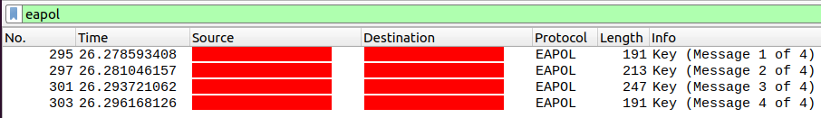
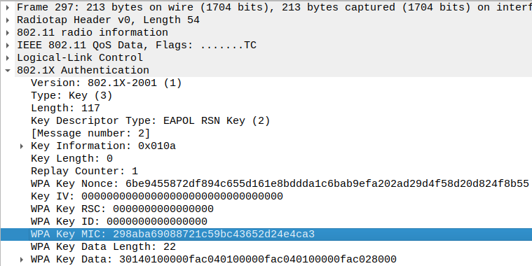
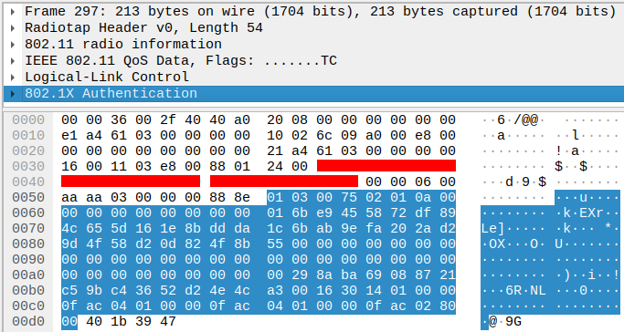
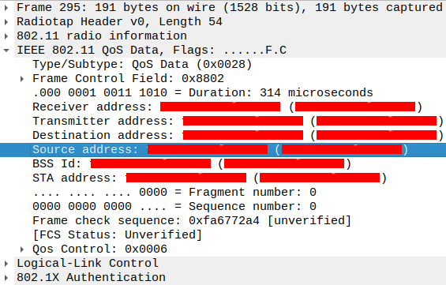
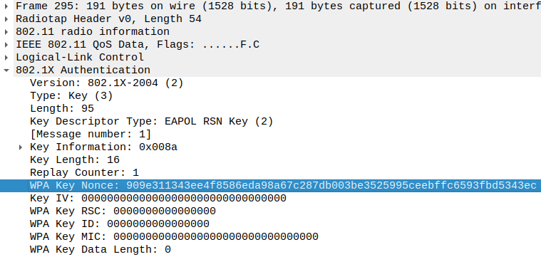

## Preamble
This is an implementation of a script that "finds" the password of a WPA2-PSK
protected wireless Network from scratch (*using Wireshark captured packets and
the "crypto" library for hashing algorithms).

This type of attack is commonly known as
"[dictionary attack](https://en.wikipedia.org/wiki/Dictionary_attack)", since
it consists in bruteforcing a series of commonly used words via trial and error.

There are a lot of alternatives that are better implemented and include a
variety of other useful tools, such as
[aircrack-ng](https://github.com/aircrack-ng/aircrack-ng).<br>
This project only exists for educational purposes and to better understand the
underlining implementations of these standards and their vulnerabilities.


### What's WPA2-PSK?
[WPA2-PSK](https://en.wikipedia.org/wiki/IEEE_802.11i-2004), among others, is a
security protocol for wireless networks (
[Wi-Fi Protected Access](https://en.wikipedia.org/wiki/Wi-Fi_Protected_Access)).
<br>
PSK stands for "Pre-shared Key", referring to the actual password used to access
the network (which is shared BEFORE the connection, between humans).
This is the password this script tries to crack.

This is obviously an oversemplification, and a much more complete and detailed
description of the protocol can be found elsewhere online.


### 4-Way Handshake
To understand how the attack works (and why it works) we have to look at the
4-way handshake first. This is the standard automatic negotiation between the
AccessPoint (AP) and the client station (STA) that starts whenever a client
wants to connect to the wireless network.

The packets sent during this handshake contain all the informations we need to
start bruteforcing the password, assuming that the client actually knows
(and uses) the correct password (PSK).

We will take a deep look at the packets' content with Wireshark.


## Hands On
### Lock your target
List all the nearby networks and locate yours: take note of SSID and channel.

    nmcli device wifi

    BSSID              SSID              MODE   CHAN  RATE        SIGNAL  BARS  SECURITY
    A1:B2:C3:D4:E5:F6  TargetNetwork     Infra  1     115 Mbit/s  100     ▂▄▆█  WPA2     
    12:34:56:78:90:AB  TP-Link_HOME      Infra  10    270 Mbit/s  77      ▂▄▆_  WPA2     
    AB:CD:EF:09:87:65  TP-Link_HOME_EXT  Infra  10    270 Mbit/s  42      ▂▄__  WPA2 

Every [channel](https://en.wikipedia.org/wiki/List_of_WLAN_channels) indicates
the precise frequency interval in which the wireless communication takes place.


### Monitor Mode
To start intercepting the packets transmitted via wireless connection, we have
to setup our web interface first.

Make sure your interface supports
[Monitor Mode](https://en.wikipedia.org/wiki/Monitor_mode).
This mode enable us to read packets on the connection without concurring to
the comunication. The "normal" mode is the Managed Mode.

If you don't know which interface to use,
check the one your wifi is attached to:

    nmcli --get-values GENERAL.DEVICE,GENERAL.TYPE device show

For starters, let's stop the NetworkManager service to avoid interference:

    service NetworkManager stop

Now we can set the interface to Monitor Mode
and specify the channel found earlier:

    ifconfig wlp4s0 down
    iwconfig wlp4s0 mode monitor
    ifconfig wlp4s0 up
    iwconfig wlp4s0 channel 10

Assert the current status of the interface:

    iwconfig wlp4s0

    wlp4s0    IEEE 802.11  Mode:Monitor  Frequency:2.457 GHz
        Tx-Power=-2147483648 dBm        Retry short limit:7
        RTS thr:off   Fragment thr:off  Power Management:on


### Wireshark
Let's open Wireshark and connect to the network. Look for "eapol" packets:
these are the 4-way handshake we need to intercept.
Only the first 2 packets are actually needed to be able to run the script.

Handshake overview:


The value that enables us to crack the password is the MIC, found in the second
packet.
The [MIC](https://en.wikipedia.org/wiki/Message_authentication_code#Message_integrity_codes)
(Message Integrity Code) is a digest of the EAPOL data and the KCK
(Key Confirmation Key).
The MIC is actually inside the payload, so we must replace it with a string of
0s of the same length.

MIC and EAPOL data in the second packet:
<br>


<!--

-->

The KCK is a part of the PTK (first 16 bytes), the key from which most of the
other keys used in the WPA2 protocol are derived.

The PTK is computed with the prf512 algorithm, a digest of MAC and nonce from the
client and the accesspoint with the PMK and the "Pairwise key expansion" label.
<!--
```js
function prf512(key: Buffer, label: string, input: Buffer): Buffer {
    let result: Buffer = Buffer.alloc(0);
    for (let i = 0; i < 4; i++) {
        const hmac = createHmac("sha1", key)
        .update(label)
        .update(Buffer.from(String.fromCharCode(0), "binary"))
        .update(input)
        .update(Buffer.from(String.fromCharCode(i), "binary"));

        const digest = hmac.digest();

        result = Buffer.concat([result, digest]);
    }

    return result.subarray(0, 64);
}

const input: Buffer = Buffer.concat([
  Buffer.from(min(MAC_AP, MAC_STA), "hex"),
  Buffer.from(max(MAC_AP, MAC_STA), "hex"),
  Buffer.from(min(ANonce, SNonce), "hex"),
  Buffer.from(max(ANonce, SNonce), "hex")
])

const PTK: Buffer = prf512Sync(PMK, "Pairwise key expansion", input);
```
-->

The PMK is computed with the pbkdf2 algorithm, with the PSK and the ESSID
(wifi name) as the salt.
<!--
```js
const PMK: Buffer = pbkdf2Sync(passphrase, ssid, iterations, keylen, "sha1");
```
-->

The MAC addresses and nonces can be extracted rispectively from the QoS and
EAPOL data of each packet:<br>


<!--


-->

We have now gathered enough informations to try and guess the password.
The method is simple: compute the PMK with a random password, find the relative
PTK with the extracted MACs and nonces and, ultimately, the KCK.
Compute the MIC with the KCK and the EAPOL data found in the second packet and
check if the result matches the extracted MIC.

If the password we tried is correct, the MIC will match!
If not, try another one.
This process is usually done with a "dictionary" of millions of common passwords
and words, often found in other breaches.
In this showcase, a little array is used, so it's not really useful as-is.

For more technical detail about how the script works,
check the comments in the source!